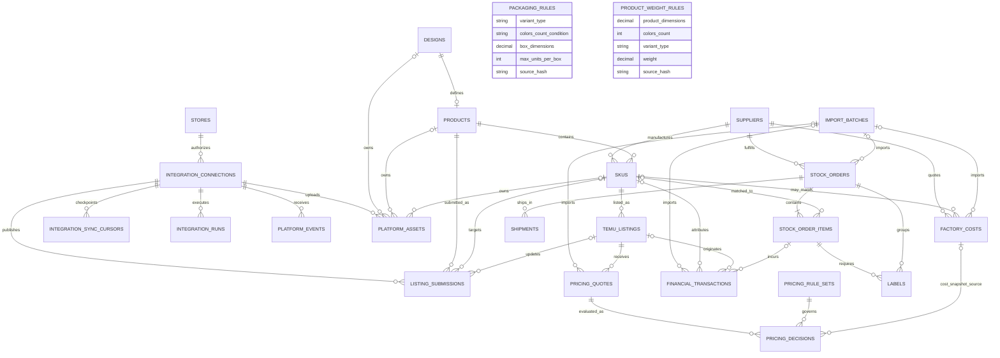

# 数据库 ER 关系

## 关系图



## 核心链路

商品追踪链为：

```text
Design.design_code
→ Product.internal_product_code
→ SKU.factory_sku
→ TemuListing.dianxiaomi_spu_id / temu_spu / temu_skc_id / temu_sku_id / temu_goods_id
→ PricingQuote / PricingDecision
→ StockOrderItem
→ Label / Shipment / FinancialTransaction
```

`products.design_id` 唯一，保证一个 Design 最多对应一个 Product/SPU。`products(id, design_id)` 和 `skus(id, design_id)` 另有组合唯一约束。SKU 使用组合外键关联 Product，确保 SKU 的 `design_id` 与所属 Product 一致。备货明细、标签和财务流水使用 `(sku_id, design_id)` 组合外键，防止出现“SKU 正确但图案错误”的数据组合。

## 删除策略

- 主数据与财务/定价历史使用 `RESTRICT`，不能因为删除商品而丢失审计链。
- 导入批次删除时，业务记录的 `import_batch_id` 设为 `NULL`，已入库内容仍保留。
- 备货单删除时允许级联删除其尚未独立结算的明细和标签；Shipment 使用 `RESTRICT`，已有发货记录时不能删除备货单。
- SKU 从报价中移除时，历史 `factory_costs.sku_id` 可设为 `NULL`，报价规格与原始来源仍保留。

## 关键约束

- `design_code` 全局唯一。
- `factory_design_code` 与内部 `design_code` 分开保存并唯一；历史记录允许暂为空，新 Listing 必须通过非空和字符校验。
- `line_art_cost` 是 Design 一次性成本；SKU 的 `unit_variable_cost_cny` 只记录工厂产品成本与运费换算结果。
- Factory SKU 在供应商内唯一；外部 Temu SKU ID 在同一店铺内唯一。
- 同一供应商、图案、尺寸、色数、带框状态只允许一个 SKU。
- 工厂报价按供应商、色数、标准化尺寸、带框状态和生效日唯一。
- 同一店铺和内部 SKU 只有一个 Temu listing；外部 Temu SKU ID 与 Goods ID 在店铺内唯一。
- 店小秘 SPU ID 与经卖家中心确认的 Temu SPU 分字段保存；来源、观察时间、审核状态及原始载荷一并留档。
- 同一规则代码和版本唯一，决策保存使用时的规则与数值快照。
- 同一备货单行号唯一；未匹配行保留 `source_temu_sku` 并允许稳定外键为空。
- 同一备货明细、标签类型和版本唯一。
- 财务流水 `idempotency_key` 唯一，防止重复导入。
- 金额使用 `NUMERIC`，不会用浮点数保存财务值；时间字段使用带时区时间戳。
- 包装和重量规则按规格唯一，并保存原文件名与 SHA-256，防止无来源规则进入物流计算。

## READY 状态的业务约束

“全部 SKU 已匹配、Design ID 完整、必需标签齐全、打印数量正确、供应商 Excel 与打印包已生成”涉及跨表聚合，不适合只依赖单行 CHECK 约束。后续 Stock Order Service 必须在同一事务中验证这些条件并更新 `stock_orders.status`，同时写入 `audit_logs`。数据库字段已经为该流程预留状态和文件路径。

## 接口凭据与幂等

- `integration_connections.credential_reference` 只能保存环境变量名或密钥管理器路径，不能保存实际 token 或 app secret。
- token 指纹、权限清单、授权时间和到期时间用于核对授权状态，不用于还原凭据。
- `integration_runs.idempotency_key` 和 `listing_submissions.idempotency_key` 全局唯一，防止重试造成重复发布或重复写入。
- `platform_events` 按连接和外部事件 ID 唯一；只有处理成功后才能推进对应同步游标。
- 请求与响应快照写库前必须移除凭据、收件人联系方式等敏感字段。
